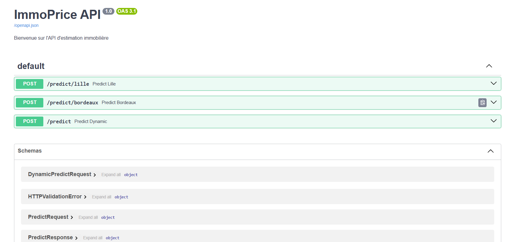

# 🏠 IA-IMMOBILIER : Estimation du Prix au m² (Lille & Bordeaux)

## 🎯 Objectif du projet

Ce projet vise à construire un **système intelligent d’estimation du prix immobilier au m²** à partir de caractéristiques du bien (surface, type, terrain…). Deux zones géographiques ont été étudiées : **Lille** et **Bordeaux**.

Les objectifs concrets sont :
- Créer des **modèles de machine learning supervisé** fiables à partir de données DVF (Demande de Valeur Foncière),
- Réentraîner ces modèles sur des données de Bordeaux,
- Comparer les performances entre les deux villes,
- Proposer un service d’estimation via une **API REST FastAPI**.

**👨‍💻 Projet réalisé dans le cadre de la formation Développeur IA chez Simplon.co** 

---

## 🧱 Structure du projet
```
IA-IMMOBILIER/
│
├── data/                     # Données sources (lille_2022.csv, bordeaux_2022.csv)
│
├── models/                   # Modèles sauvegardés (.pkl/.joblib)
│   ├── model_lille.pkl
│   └── model_bordeaux.pkl
│
├── notebooks/                # Analyses exploratoires et modélisation
│   ├── phase_1_lille.ipynb
│   ├── phase_2_bordeaux.ipynb
│   └── comparaison.ipynb     # Compare Lille vs Bordeaux + réentraînement
│
├── app/                      # API FastAPI
│   ├── main.py               # Point d’entrée
│   ├── routes.py             # Définition des endpoints
│   ├── schemas.py            # Validation des données (Pydantic)
│   ├── model_loader.py       # Chargement des modèles
│   ├── predict.py            # Fonctions de prédiction
│   └── utils.py              # Prétraitements (encodage, nettoyage…)
│
├── tests/                    # Tests unitaires (pytest)
│   ├── test_predict_lille.py
│   ├── test_predict_bordeaux.py
│   └── test_predict_dynamic.py
│
├── requirements.txt          # Dépendances Python
├── README.md                 # Documentation du projet
├── .gitignore                # Fichiers à ignorer
└── pytest.ini                # Config pytest

```

---

## 🧠 Phase 1 – Modélisation sur Lille

📄 `notebooks/phase_1_lille.ipynb`

- Nettoyage des données DVF
- Modélisation avec :
  - LinearRegression
  - DecisionTreeRegressor
  - RandomForestRegressor
  - GridSearchCV (Random Forest optimisé)
  - XGBoost
- Évaluation (MSE, RMSE, R²)
- Sauvgarde des modèles dans `model_lille.pkl`

---

## 🔁 Phase 2 – Réentraînement sur Bordeaux

📄 `notebooks/phase_2_bordeaux.ipynb`

- Pipeline réutilisé sur les données de Bordeaux
- Évaluation sur les nouvelles données

---

## 📊 Comparaison entre Lille & Bordeaux

📄 `notebooks/comparaison.ipynb`

- Analyse des différences de distribution (graphiques KDE)
- Tests de Kolmogorov-Smirnov sur chaque variable
- Réentraînement complet des modèles
- Comparaison entre les prédictions et les valeurs réelles
- Sauvegarde des modèles dans `model_bordeaux.pkl`

---

## 🌐 API REST avec FastAPI

📁 Dossier `app/` – Exposition des modèles

### Endpoints disponibles :

- `POST /predict/lille` → prédiction via le modèle de Lille
- `POST /predict/bordeaux` → prédiction via le modèle de Bordeaux
- `POST /predict` → endpoint unique avec choix dynamique

📤 Exemple de requête :
```json
{
  "ville": "bordeaux",
  "features": {
    "surface_bati": 110,
    "nombre_pieces": 4,
    "type_local": "Maison",
    "surface_terrain": 300,
    "nombre_lots": 2
  }
}
```

📥 Réponse :
```json
{
  "prix_m2_estime": 3950.25,
  "ville_modele": "Bordeaux",
  "model": "Random Forest Optimized"
}
```

Accès à la documentation interactive : http://127.0.0.1:8000/docs

---

## ⚙️ Installation

```bash
git clone https://github.com/Adjaaaaaaaa/IA-Immobilier.git
cd IA-IMMOBILIER

python -m venv venv
source venv/bin/activate  # ou venv\Scripts\activate sous Windows
pip install -r requirements.txt
uvicorn app.main:app --reload
```

---

## 🧪 Tests unitaires (pytest)

```bash
pytest
```

- Test des prédictions pour Lille, Bordeaux, et endpoint dynamique
- Vérifie la structure de la réponse, la cohérence des valeurs, etc.

---
## 🧪 Interface 





